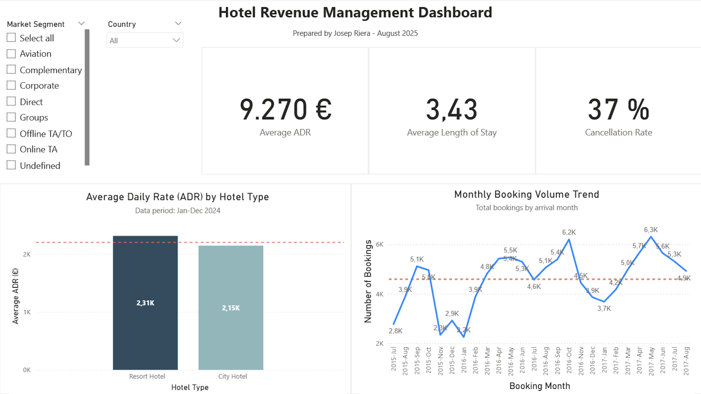

# Portfolio_Revenue_Management

This repository contains Revenue Management and Business Intelligence projects applied to the hospitality industry.

## Folder Structure

```
Portfolio_Revenue_Management/
├── 01_Raw_Data/
│   └── synthetic_data/
│       └── synthetic_hotel_bookings.csv
│   ├── hotel_booking_clean.csv
│   ├── kaggle_hotel_booking.csv
│   └── portfolio.db
├── 02_Python_Scripts/
│   ├── analysis.py
│   ├── data_cleaning.py
│   ├── data_generation.py
│   └── load_to_sqlite.py
├── 03_SQL_Queries/
│   ├── analysis_queries.sql
│   └── create_tables.sql
├── 04_PowerBI_Files/
│   └── Portfolio_Hotel_Revenue_Management_Dashboard_JosepRiera.pbix
└── 05_Documentation/
    └── dashboard_screenshot.png
```

## Project #1: Hotel Revenue Management Dashboard

- **Power BI File**: `04_PowerBI_Files/Portfolio_Hotel_Revenue_Management_Dashboard_JosepRiera.pbix`  
- **Screenshot**:

  

- **Description**:  
  Interactive dashboard that allows you to:
  - View **Average ADR (€)**, **Average Length of Stay**, and **Cancellation Rate (%)**  
  - Compare **Average ADR by Hotel Type** with a portfolio average line  
  - See monthly booking volume trends  
  - Dynamically filter by **Market Segment** and **Country**

## Prerequisites

- **Software**  
  - Power BI Desktop (Windows)  
  - Anaconda with Python 3.10+  
  - SQLite (macOS) / SQL Server Express (Windows)  
  - Git and GitHub CLI (recommended)

- **Python Libraries**  
  After creating and activating your environment, install:
  ```bash
  pip install pandas numpy sdv faker matplotlib seaborn plotly scikit-learn sqlalchemy jupyter
  ```

## Reproduction Steps

1. Clone the repository  
   ```bash
   git clone git@github.com:jopriera/Portfolio_Revenue_Management.git
   cd Portfolio_Revenue_Management
   ```
2. Set up Python environment  
   ```bash
   conda create -n rm_portfolio python=3.10 -y
   conda activate rm_portfolio
   pip install pandas numpy sdv faker matplotlib seaborn plotly scikit-learn sqlalchemy jupyter
   ```
3. Download datasets and place them in `01_Raw_Data/`  
4. (Optional) Generate synthetic data  
   ```bash
   python 02_Python_Scripts/data_generation.py
   ```
5. Clean data  
   ```bash
   python 02_Python_Scripts/data_cleaning.py
   ```
6. Load data into SQLite  
   ```bash
   python 02_Python_Scripts/load_to_sqlite.py
   ```
7. Execute exploratory analysis  
   ```bash
   python 02_Python_Scripts/analysis.py
   ```
8. Open the dashboard in Power BI Desktop  
  Navigate to `04_PowerBI_Files/Portfolio_Hotel_Revenue_Management_Dashboard_JosepRiera.pbix` and open it.

## Skills Demonstrated

- Python: pandas, SDV, SQLite  
- SQL: SQLite  
- Power BI: DAX, interactive visualizations  
- Data Visualization & EDA

## Next Steps

Project #2: Cancellation Analysis and Advanced Segmentation

---

For feedback or questions, open an issue or contact me on LinkedIn.
